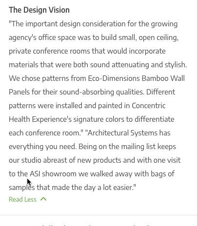

# Read more



```
npm install @crossfield/react-read-more
```

This read more component helps truncate large chunks of text/html and animates to the full height of the inner content.


# Example

```js
<ReadMore
  initialHeight={350}
  readMore={props => (
    <ReadMoreButton onClick={props.onClick}>
      {props.open ? 'Read Less' : 'Read More'}
      <Icon
      name="caret"
      style={{
        transform: `rotate( ${props.open ? '-90deg' : '90deg'})`,
        transition: 'transform 0.25s',
      }}
      />
    </ReadMoreButton>
  )}
>
  <Label>The Design Vision</Label>
  <Text>
      SOME LONG TEXT
  </Text>
</ReadMore>
```

# Props

**initialHeight**

The closed size of the container

**readMore**

render function that gives you a props object containing `open` and `onClick` to toggle open / close


 
